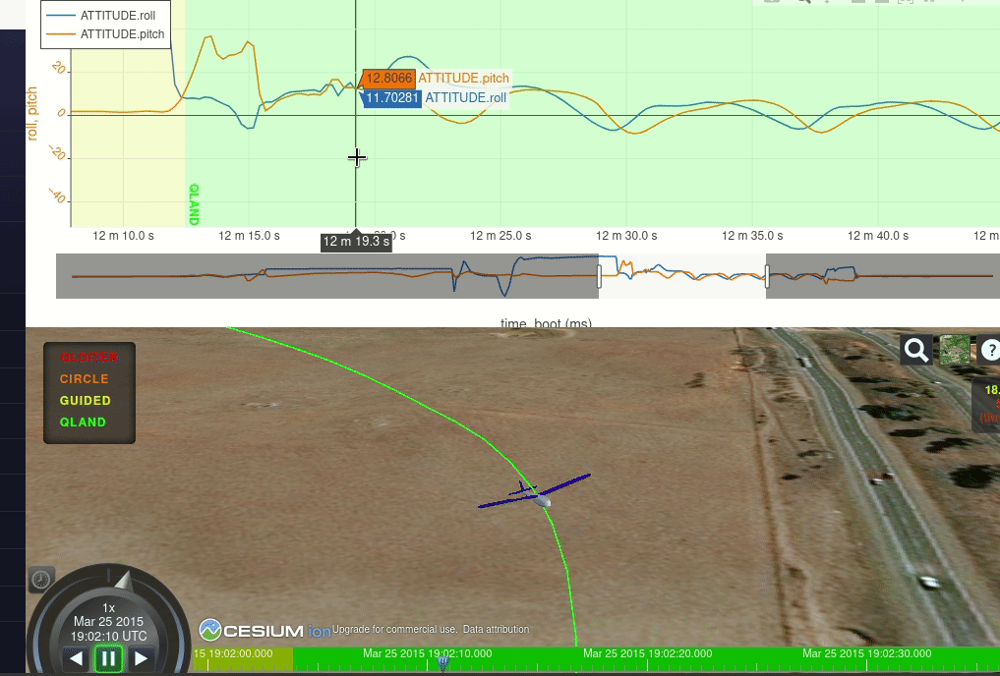

# OpenUAS Log Viewer



## Forked project of UAV Log Viewer by ArduPilot
[UAV Log Viewer](https://github.com/ArduPilot/UAVLogViewer)

 This is a Javascript based log viewer for Mavlink telemetry and dataflash logs.
 [Live demo here](http://plot.ardupilot.org).

### Project Goals:
* Extend functionality to include parsed DJI flight logs.
* Allow for manual input of GPS coordinate arrays for unsupported logs formats.
* Offline mapping using predownloaded tiles
* Visual planes showing objects detected by on-board obstacle avoidance sensors.
* Georeferencing images and videos during playback
* Report generation highlighting key events and flight details.

## Build Setup

``` bash
# requires:
# - node:14
# - Visual Studio w/ C++ workload (or equivalent build tools)
# install dependencies
npm install

# serve with hot reload at localhost:8080
npm run dev

# build for production with minification
npm run build

# run unit tests
npm run unit

# run e2e tests
npm run e2e

# run all tests
npm test
```

## Configuration

### Cesium Ion Access Token (Optional)

The application uses Cesium for 3D visualization and mapping. While it works without configuration, you can get enhanced imagery and terrain data by setting up a free Cesium Ion account:

1. Sign up for a free account at [https://cesium.com/ion/](https://cesium.com/ion/)
2. Create an access token in your Ion dashboard
3. Edit `src/config/cesium.js` and set your token:
   ```javascript
   export const CESIUM_ION_ACCESS_TOKEN = 'your_token_here'
   ```

**Note:** The application will work without a token using OpenStreetMap and other free providers, but you may see some 403 errors in the console for premium Cesium assets.

# Docker

``` bash

# Build Docker Image
docker build -t <your username>/uavlogviewer .

# Run Docker Image
docker run -p 8080:8080 -d <your username>/uavlogviewer

# View Running Containers
docker ps

# View Container Log
docker logs <container id>

# Navigate to localhost:8080 in your web browser

```
